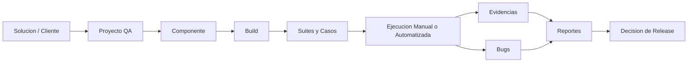
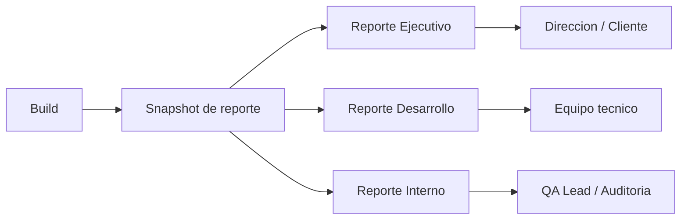
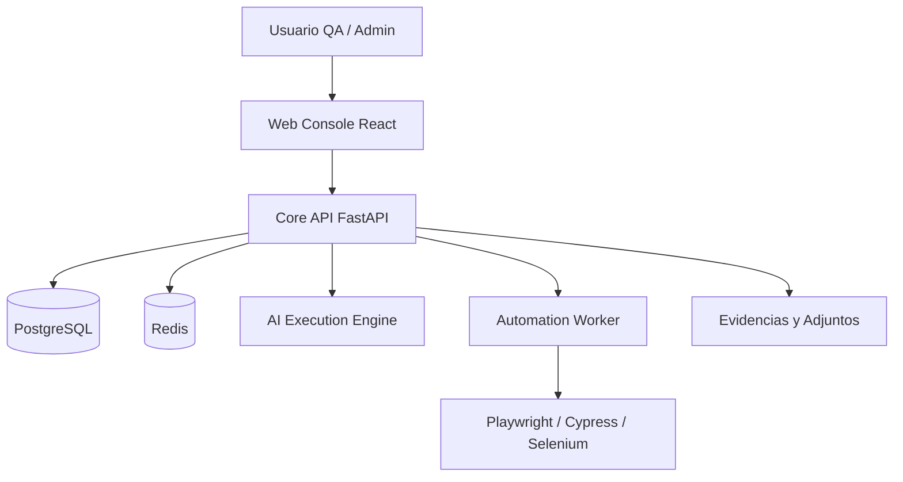

# Treseko Platform

[](VERSION)
[](#ediciones)
[](LICENSE)
[](backend/)
[](frontend/)
[](docs/DATABASE.md)
[](automation-worker/)

Treseko es una plataforma open core para gestionar QA de punta a punta: casos de prueba, ejecuciones manuales, automatizacion, evidencias, bugs, reportes de build y trazabilidad para decisiones de release.

La version Community esta pensada para equipos que quieren una instalacion self-hosted limpia, auditable y lista para crecer hacia capacidades Premium cuando corresponda.

- Sitio oficial: [treseko.com](https://treseko.com)
- Terminos y condiciones: [treseko.com/terminos-y-condiciones](https://treseko.com/terminos-y-condiciones)
- Licencia del codigo Community: [AGPL-3.0-or-later](LICENSE)


## Por Que Treseko

Muchas organizaciones terminan combinando planillas, Jira, carpetas de evidencias, reportes manuales y automatizaciones sueltas. Treseko unifica ese flujo en una sola consola:

| Necesidad | Herramientas tradicionales | Treseko |
|---|---|---|
| Casos de prueba | Planillas o test managers aislados | Suites jerarquicas, casos versionados y builds |
| Ejecucion manual | Evidencia dispersa y poco contexto | Pasos, resultados, snapshots y adjuntos por ejecucion |
| Bugs | Tickets sin contexto QA completo | Bug tracker interno con caso, build, evidencia y responsable |
| Automatizacion | Jobs externos dificiles de rastrear | Workers aprobados, jobs y resultados vinculados a QA |
| Reportes | Informes manuales o screenshots | Dashboard, metricas de build y reportes compartibles |
| IA | Herramientas separadas | Motor IA integrado al flujo de ejecucion y analisis |
| Gestión | Permisos generales | RBAC por capacidades y gates Community/Premium |

## Flujo De Trabajo



## Participantes Del Flujo QA

Treseko ordena el trabajo segun quien necesita mirar la informacion:

| Participante | Que hace en Treseko | Que recibe |
|---|---|---|
| QA manual | Ejecuta pasos, adjunta evidencias y reporta fallos | Consola de ejecucion y trazabilidad por caso |
| QA automation | Vincula workers, scripts y ejecuciones automatizadas | Resultados ligados a build, suite y caso |
| QA lead | Revisa cobertura, fallos, bloqueos y riesgo de release | Dashboard y reportes de build |
| Desarrollo | Analiza bugs con contexto tecnico y evidencia | Reporte de desarrollo y bug tracker |
| Management / cliente | Revisa estado, riesgo y recomendacion | Reporte ejecutivo compartible |
| Equipo interno | Audita decisiones, snapshots y trazabilidad | Reporte interno con detalle operativo |

### Reportes Y Snapshots

Los reportes se generan como snapshots de una build. Eso permite conservar una foto estable del estado QA aunque luego el equipo siga trabajando en otra version.



Cada tipo de reporte responde una pregunta distinta:

- **Ejecutivo**: si la build esta lista, que riesgo tiene y que bloquea el release.
- **Desarrollo**: que fallos, bugs y evidencias necesita revisar el equipo tecnico.
- **Interno**: que decisiones, datos y trazabilidad sostienen el resultado QA.

## Arquitectura



## Componentes Del Repositorio

- `frontend/`: consola web React/Vite.
- `backend/`: API principal FastAPI, RBAC, datos, reportes, bugs y gates de edicion.
- `engine/`: motor de ejecucion asistida por IA.
- `automation-worker/`: runner local o remoto para Playwright, Cypress, Puppeteer y Selenium.
- `scripts/`: scripts publicos de instalacion.
- `docs/`: documentacion tecnica, operativa y de API.

Los servicios comerciales privados de Treseko no forman parte de este repositorio publico.

## Capacidades Principales

- Soluciones, proyectos, componentes y builds.
- Suites jerarquicas con colores/iconos y casos versionados.
- Ejecucion manual con pasos, snapshots y estados.
- Adjuntos y evidencias por ejecucion.
- Bug tracker interno con contexto QA.
- Dashboard de calidad, tendencia, duracion y cobertura.
- Reportes de build y trazabilidad.
- Workers de automatizacion aprobados por codigo.
- Integracion con motor IA para ejecucion y analisis.
- Roles, permisos y capacidades granulares.
- Edicion Community con funciones Premium visibles como bloqueadas.
- Instalacion self-hosted con Docker.

## Ediciones

| Edicion | Objetivo | Estado |
|---|---|---|
| Community | Consola QA self-hosted para equipos pequenos y medianos | Incluida |
| Premium | Capacidades avanzadas habilitadas para clientes | Preparada por gates |

Community no llama endpoints Premium si no existe entitlement. Las funciones Premium se comunican como capacidades bloqueadas, no como errores tecnicos.

## Descarga

Clonar el repositorio y entrar en la carpeta creada:

Desde Linux/macOS:

```bash
git clone https://github.com/treseko/treseko-platform.git
cd treseko-platform
```

Desde Windows PowerShell:

```powershell
git clone https://github.com/treseko/treseko-platform.git
cd treseko-platform
```

## Inicio Rapido

Requisitos:

- Docker 24+
- Docker Compose v2
- Linux recomendado para instalaciones productivas

### Probar En Local

Desde Linux/macOS:

```bash
scripts/install_local_treseko.sh --http-port 9095
```

Desde Windows PowerShell:

```powershell
.\scripts\install_local_treseko.ps1 -HttpPort 9095
```

Con datos demo:

```bash
scripts/install_local_treseko.sh --with-demo
```

El instalador local genera secretos, levanta Docker Compose, crea el admin inicial y muestra una contraseña temporal.

### Actualizar Una Instalacion Existente

Si ya clonaste Treseko antes de esta correccion, actualiza el repositorio y recrea los contenedores para tomar los keyrings publicos embebidos de licencias, servidor Premium y updates:

```bash
git pull --ff-only
docker compose -f docker-compose.prod.yml up -d --build
```

Luego entra a **Configuracion > Licencia**, instala nuevamente tu archivo `.treseko` vigente o pulsa actualizar estado si ya estaba instalado. Una licencia Premium valida debe quedar en estado **Activa** sin requerir variables `TRESEKO_ALLOW_DEV_*`.

### Instalar En Un Servidor Por SSH

Desde Linux:

```bash
scripts/install_remote_treseko.sh usuario@servidor --http-port 9095
```

Desde Windows PowerShell:

```powershell
.\scripts\install_remote_treseko.ps1 usuario@servidor -HttpPort 9095
```

El instalador remoto sube el proyecto al servidor, genera secretos, ejecuta migraciones, crea el admin inicial y devuelve usuario + contraseña temporal.

> El servidor destino debe ser Linux. Windows funciona como equipo cliente para lanzar la instalacion por SSH.

### Instalacion Manual

Crear archivo de configuracion:

```bash
cp .env.production.example compose.production.env
```

Editar `compose.production.env` y completar, como minimo:

```env
APP_ENV=production
TRESEKO_HTTP_PORT=9095
TRESEKO_DB_PASSWORD_FILE=/ruta/segura/db-password
TRESEKO_DATABASE_URL_FILE=/ruta/segura/database-url
TRESEKO_SECRET_KEY_FILE=/ruta/segura/secret-key
DB_USER=treseko
DB_NAME=treseko
```

Levantar servicios:

```bash
docker compose -f docker-compose.prod.yml --env-file compose.production.env up -d --build
```

Ejecutar migraciones:

```bash
docker compose -f docker-compose.prod.yml --env-file compose.production.env run --rm migrator
```

Crear el primer administrador:

```bash
docker compose -f docker-compose.prod.yml --env-file compose.production.env run --rm --entrypoint python backend /app/seed_admin.py
```

Abrir:

```text
http://localhost:9095
```

La primera password del administrador debe cambiarse despues del login inicial.

## Instalacion Limpia

Una instalacion productiva limpia no crea soluciones, proyectos, builds ni datos demo. Despues del primer login, el administrador crea la primera solucion desde la interfaz.

Para demos locales solamente:

```bash
docker compose -f docker-compose.prod.yml --env-file compose.production.env run --rm --entrypoint python backend /app/seed_demo_showcase.py
```

No ejecutes seeds demo en produccion.

## Automatizacion

El automation worker es un proceso separado. En V1 se vincula mediante aprobacion desde la consola y se identifica por token + heartbeat, no por IP ni por puerto.

```bash
cd automation-worker
cp .env.example .env
npm install
npm start
```

El worker muestra un codigo como `WK-123456`. Apruebalo desde `Automatizacion > Workers`.

## IA Integrada

Treseko no trata la IA como una herramienta externa aislada. El motor IA se conecta al flujo QA para:

- asistir ejecuciones;
- generar analisis compactos;
- ayudar a revisar fallos;
- preparar trazabilidad para reportes;
- conservar auditoria y limites por edicion.

La ejecucion y los datos sensibles siguen gobernados por el backend, RBAC y configuracion del sistema.

## Documentacion

Empieza por aqui:

- [Instalacion rapida](docs/INSTALLATION.md)
- [Guia Docker](docs/DOCKER_GUIDE.md)
- [Instalacion Linux](docs/LINUX_SETUP.md)
- [Arquitectura](docs/ARCHITECTURE.md)
- [API](docs/API_SPEC.md)
- [Uso de API](docs/API_USAGE_GUIDE.md)
- [Auth y RBAC](docs/AUTH_RBAC_GUIDE.md)
- [Estrategia de ediciones](docs/EDITION_STRATEGY.md)
- [Automation Worker V1](docs/AUTOMATION_WORKER_V1.md)
- [API de automatizacion externa](docs/EXTERNAL_AUTOMATION_API.md)
- [Evidencias y adjuntos](docs/ATTACHMENTS_EVIDENCE.md)
- [Bug Tracker](docs/BUG_TRACKER.md)
- [Publicacion](PUBLISHING.md)

## Higiene Del Repositorio

Este arbol publico excluye intencionalmente:

- archivos `.env` locales;
- logs generados;
- bases de datos locales y backups;
- servicios comerciales privados;
- llaves privadas o tooling sensible;
- auditorias internas;
- evidencias adversariales de laboratorio;
- notas de desarrollo y planes temporales.

## Version

Version actual: `0.9.0-rc.1`

Este es un release candidate de Community. Usalo para evaluacion, demos e instalaciones controladas antes de una version estable `1.0.0`.

## Licencia Del Repositorio

Treseko Community se publica bajo **GNU Affero General Public License v3.0 o posterior** (`AGPL-3.0-or-later`). Consulta [LICENSE](LICENSE).

Los servicios comerciales privados, infraestructura Premium, servicios de autoridad, operaciones comerciales y material sensible no forman parte de este repositorio publico.

La marca Treseko, logos e identidad visual se rigen por [TRADEMARKS.md](TRADEMARKS.md). La licencia del codigo no concede permiso para usar la marca de forma que sugiera afiliacion, endorsement o canal oficial.
