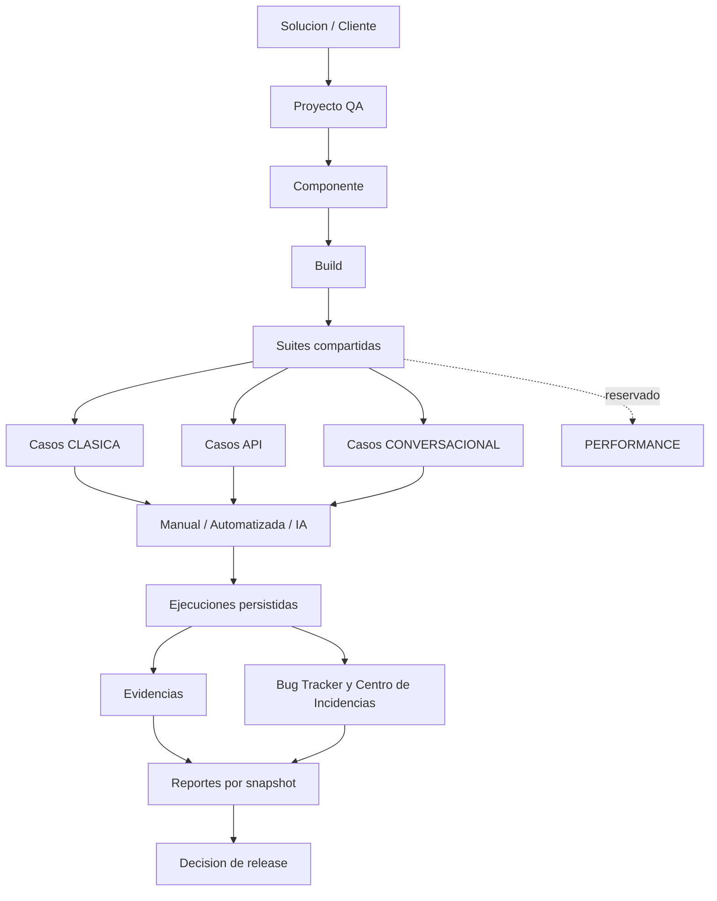
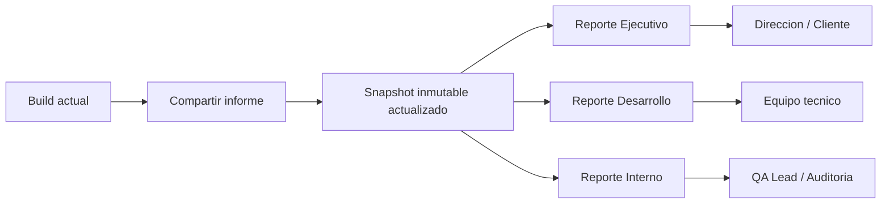
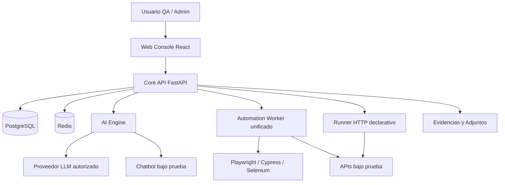

# Treseko Platform

[](VERSION)
[](#ediciones)
[](LICENSE)
[](backend/)
[](frontend/)
[](docs/DATABASE.md)
[](automation-worker/)

**Treseko Community** es un gestor de pruebas de software de código abierto para equipos QA y desarrollo. Organizá casos de prueba, ejecuciones, evidencias y bugs en un solo lugar; instalalo en tu propio servidor con Docker y conservá la trazabilidad necesaria para decidir cada release con contexto.

La edición Community está pensada para equipos de QA, desarrollo y producto que buscan una instalación limpia, auditable y lista para crecer hacia capacidades Premium cuando corresponda.

### Novedades de 1.0.3

Esta release amplía el flujo QA sin separar la información en herramientas
aisladas:

- Nuevos formatos de caso para pruebas **API** y **conversacionales**, además
  del formato **clásico**. **PERFORMANCE** queda reservado para una futura
  implementación y no debe configurarse como si ya tuviera un ejecutor.
- Separación explícita entre el formato del caso y la modalidad de ejecución:
  **MANUAL**, **AUTOMATIZADA** y **AUTOMATIZADA_AI**.
- Ejecución API declarativa desde el backend y el Automation Worker existente,
  con aserciones, variables, allowlist, límites y snapshots redactados.
- Pruebas conversacionales con endpoint, perfiles, datasets, turnos, memoria,
  herramientas, evaluación y evidencia de la conversación.
- Evidencia y contexto de bugs adaptados a los formatos clásico, API y
  conversacional, con trazabilidad hacia caso, build y ejecución.
- Informes ejecutivos, de desarrollo e internos basados en snapshots
  compartibles, incluyendo bugs actuales e históricos pendientes.
- Mejoras en historial, trazabilidad, RBAC, capacidades por edición, temas y
  configuración de conexiones.
- Las migraciones `20260812_0045` y `20260812_0046` agregan el formato de caso
  de forma idempotente, conservan los casos existentes y normalizan su nombre
  público final a **CLÁSICA**.
- El dashboard muestra errores legibles y permite reintentar la carga cuando
  una actualización todavía está terminando.

### Novedades de 1.0.2

- Control de versión unificado entre la aplicación, el frontend, el motor y el worker.
- Historial de calidad y reportes preparado para comparar builds sin alterar datos históricos.
- Mejoras de trazabilidad, evidencias, ejecuciones y administración documentadas para la nueva release.

Para ver el detalle completo de cambios, consultá el [changelog](CHANGELOG.md).

Podés ver capturas de las principales secciones en la [galería de capturas](screenshots/README.md).

### Vista rápida

Así se ve Treseko Community en las áreas principales de trabajo:

<p align="center">
  <a href="screenshots/dashboard.png"></a>
  <a href="screenshots/proyectos.png"></a>
  <a href="screenshots/ejecutar-pruebas.png"></a>
</p>

Explorá las [33 capturas de la galería](screenshots/README.md) para conocer el flujo completo de proyectos, casos, ejecuciones, evidencias, automatización, reportes y configuración.

### Novedades de 1.0.1

- Actualizador preparado para futuras migraciones, hooks y rollback.
- Validación automática de versiones y protección contra imágenes antiguas.
- Actualizaciones e instalación Community más confiables.
- Importación de casos con más formatos y mejores diagnósticos.
- Trazabilidad, evidencias, reportes y métricas de build ampliados.
- Automatización e IA con seguimiento más claro de resultados.
- Administración, permisos, notificaciones y suscripciones mejorados.

Para ver el resumen completo, consultá el [changelog](CHANGELOG.md).

> **Conocé Treseko, sus ediciones y la propuesta de producto en la [landing oficial de Treseko](https://treseko.com).**

- Sitio oficial: [treseko.com](https://treseko.com)
- Web del mantenedor: [biuler.com](https://www.biuler.com)
- Mantenedor: [José Manuel Zúñiga](https://www.linkedin.com/in/jose-manuel-zuniga/)
- Contacto: [jose@treseko.com](mailto:jose@treseko.com)
- Terminos y condiciones: [treseko.com/terminos-y-condiciones](https://treseko.com/terminos-y-condiciones)
- Licencia del codigo Community: [AGPL-3.0-or-later](LICENSE)

Este repositorio público contiene la edición Community bajo AGPL. Los servicios
comerciales y la infraestructura de licencias no forman parte de esta publicación.


## Por Qué Treseko

Muchas organizaciones terminan combinando planillas, Jira, carpetas de evidencias, reportes manuales y automatizaciones sueltas. Treseko unifica ese flujo en una sola consola:

| Necesidad | Herramientas tradicionales | Treseko |
|---|---|---|
| Casos de prueba | Planillas o test managers aislados | Suites jerárquicas, casos versionados y builds |
| Ejecución manual | Evidencia dispersa y poco contexto | Pasos, resultados, snapshots y adjuntos por ejecución |
| Bugs | Tickets sin contexto QA completo | Bug tracker interno con caso, build, evidencia y responsable |
| Automatizacion | Jobs externos dificiles de rastrear | Workers aprobados, jobs y resultados vinculados a QA |
| Reportes | Informes manuales o screenshots | Dashboard, metricas de build y reportes compartibles |
| IA | Herramientas separadas | Motor IA integrado al flujo de ejecucion y analisis |
| Gestión | Permisos generales | RBAC por capacidades y gates Community/Premium |

## Flujo De Trabajo

Flujo funcional de Treseko Community 1.0.3:


```mermaid
flowchart TB
  A[Solucion / Cliente] --> B[Proyecto QA]
  B --> C[Componente]
  C --> D[Build]
  D --> E[Suites compartidas]
  E --> FC[Casos CLASICA]
  E --> FA[Casos API]
  E --> FCH[Casos CONVERSACIONAL]
  E -. reservado .-> FP[PERFORMANCE]
  FC --> M[Manual / Automatizada / IA]
  FA --> M
  FCH --> M
  M --> X[Ejecuciones persistidas]
  X --> G[Evidencias]
  X --> H[Bug Tracker y Centro de Incidencias]
  G --> I[Reportes por snapshot]
  H --> I
  I --> J[Decision de release]
```

## Participantes Del Flujo QA

Treseko ordena el trabajo segun quien necesita mirar la informacion:

| Participante | Qué hace en Treseko | Qué recibe |
|---|---|---|
| QA manual | Ejecuta pasos, adjunta evidencias y reporta fallos | Consola de ejecucion y trazabilidad por caso |
| QA automation | Vincula workers, scripts y ejecuciones automatizadas | Resultados ligados a build, suite y caso |
| QA lead | Revisa cobertura, fallos, bloqueos y riesgo de release | Dashboard y reportes de build |
| Desarrollo | Analiza bugs con contexto tecnico y evidencia | Reporte de desarrollo y bug tracker |
| Management / cliente | Revisa estado, riesgo y recomendacion | Reporte ejecutivo compartible |
| Equipo interno | Audita decisiones, snapshots y trazabilidad | Reporte interno con detalle operativo |

### Reportes Y Snapshots

Los reportes se generan como snapshots de una build. Eso permite conservar una foto estable del estado QA aunque luego el equipo siga trabajando en otra version.


```mermaid
flowchart LR
  B[Build actual] --> C[Compartir informe]
  C --> S[Snapshot inmutable actualizado]
  S --> E[Reporte Ejecutivo]
  S --> D[Reporte Desarrollo]
  S --> I[Reporte Interno]
  E --> M[Direccion / Cliente]
  D --> DEV[Equipo tecnico]
  I --> QA[QA Lead / Auditoria]
```

Cada tipo de reporte responde una pregunta distinta:

- **Ejecutivo**: si la build está lista, qué riesgo tiene y qué bloquea el release.
- **Desarrollo**: qué fallos, bugs y evidencias necesita revisar el equipo técnico.
- **Interno**: qué decisiones, datos y trazabilidad sostienen el resultado QA.

## Arquitectura

Arquitectura operativa de Treseko Community 1.0.3:


```mermaid
flowchart TB
  U[Usuario QA / Admin] --> FE[Web Console React]
  FE --> API[Core API FastAPI]
  API --> DB[(PostgreSQL)]
  API --> REDIS[(Redis)]
  API --> ENGINE[AI Engine]
  API --> WORKER[Automation Worker unificado]
  API --> HTTP[Runner HTTP declarativo]
  ENGINE --> LLM[Proveedor LLM autorizado]
  ENGINE --> CHATBOT[Chatbot bajo prueba]
  WORKER --> BROWSERS[Playwright / Cypress / Selenium]
  WORKER --> APIS[APIs bajo prueba]
  HTTP --> APIS
  API --> STORAGE[Evidencias y Adjuntos]
```

## Componentes Del Repositorio

- `frontend/`: consola web React/Vite.
- `backend/`: API principal FastAPI, RBAC, datos, reportes, bugs y gates de edicion.
- `engine/`: motor de ejecucion asistida por IA.
- `automation-worker/`: runner local o remoto para Playwright, Cypress, Puppeteer y Selenium, con capacidad para pruebas API declarativas.
- `scripts/`: scripts publicos de instalacion.
- `docs/`: documentacion tecnica, operativa y de API.

Los servicios comerciales privados de Treseko no forman parte de este repositorio publico.

## Capacidades Principales

- Soluciones, proyectos, componentes y builds.
- Suites jerarquicas con colores/iconos y casos versionados.
- Ejecución manual con pasos, snapshots y estados.
- Casos API con contratos declarativos, aserciones, variables y evidencia.
- Casos conversacionales con turnos, memoria, herramientas y evaluación.
- Adjuntos y evidencias por ejecucion.
- Bug tracker interno con contexto QA.
- Dashboard de calidad, tendencia, duración y cobertura.
- Reportes de build, snapshots compartibles y trazabilidad.
- Portabilidad de casos con paquete oficial `.tcases`, perfiles de importación
  versionados y reversión auditable de lotes elegibles.
- Requisitos, historias y criterios de aceptación vinculados con casos y su
  cobertura de ejecución.
- Workers de automatización aprobados por código.
- Integración con motor IA para ejecución y análisis.
- Roles, permisos y capacidades granulares.
- Edición Community con funciones Premium visibles como bloqueadas.
- Instalación self-hosted con Docker.

## Ediciones

Treseko usa el mismo producto en todas las ediciones. Community es gratuito y
self-hosted; una licencia Premium firmada amplía capacidades y límites sin
obligar a reinstalar ni mover los datos.

| Edición | Pensada para | Incluye |
|---|---|---|
| Community | Equipos que quieren ordenar QA, automatizar y usar IA en su propia infraestructura. | Soluciones, proyectos, casos, builds, ejecuciones manuales, Bug Tracker básico con evidencias, reportes básicos, automatización local y API declarativa mediante el worker unificado, Motor IA dentro de sus cuotas y actualizaciones Community. |
| Premium | Equipos que necesitan ampliar capacidades o límites. | Habilita únicamente las capacidades y cuotas incluidas en la licencia firmada instalada; pueden abarcar RBAC avanzado, múltiples workers, API externa de reportes, snapshots, integraciones u otras funciones Premium. |

La edición reconocida por el runtime público es `community` o `premium`. Los
nombres, paquetes y compromisos comerciales específicos se definen fuera de
este repositorio. La disponibilidad final de cada función depende de las
capacidades y límites firmados en la licencia, los permisos RBAC y la
configuración de la instancia.

Para instalar o revisar una licencia, abrí **Configuración → Licencia**. Las
funciones no habilitadas se muestran como bloqueadas de forma clara, sin
exponer errores técnicos al usuario.

## Descarga

Clonar el repositorio y entrar en la carpeta creada:

Desde Linux/macOS:

```bash
git clone https://github.com/treseko/treseko-platform.git
cd treseko-platform
```

Desde Windows PowerShell:

```powershell
git clone https://github.com/treseko/treseko-platform.git
cd treseko-platform
```

## Inicio Rapido

Requisitos:

- Docker 24+
- Docker Compose v2
- Linux recomendado para instalaciones productivas

### Probar En Local

Desde Linux/macOS:

```bash
scripts/install_local_treseko.sh --http-port 9095
```

Desde Windows PowerShell:

```powershell
.\scripts\install_local_treseko.ps1 -HttpPort 9095
```

### Instalador gráfico macOS

El workflow de empaquetado genera un `.app` nativo para Apple Silicon
(`macos-14`, `arm64`) y otro para Intel (`macos-13`, `x64`). Descomprimí el
artefacto y abrilo con doble clic. El `.app` es el bundle ejecutable; no se
genera `.dmg`. La firma y notarización de Apple están pendientes, por lo que
Gatekeeper puede mostrar una advertencia en el primer arranque. Ver el detalle
en [`installer/README.md`](installer/README.md).

Con datos demo:

```bash
scripts/install_local_treseko.sh --with-demo
```

El instalador local genera secretos, levanta Docker Compose, crea el admin inicial y muestra una contraseña temporal.

### Actualizar Una Instalacion Existente

Si ya clonaste Treseko antes de esta correccion, actualiza el repositorio y recrea los contenedores para tomar los keyrings publicos embebidos de licencias, servidor Premium y updates:

```bash
git pull --ff-only
docker compose -f docker-compose.prod.yml up -d --build
```

Luego entra a **Configuracion > Licencia**, instala nuevamente tu archivo `.treseko` vigente o pulsa actualizar estado si ya estaba instalado. Una licencia Premium valida debe quedar en estado **Activa** sin requerir variables `TRESEKO_ALLOW_DEV_*`.

### Instalar En Un Servidor Por SSH

> **Limitación de 1.0.3:** el instalador remoto actual transporta secretos en
> argumentos del comando SSH. Usalo únicamente en entornos de prueba. Para
> producción, preferí la [instalación manual con secretos por archivo](docs/INSTALLATION.md#instalación-manual)
> hasta que ese transporte sea reforzado.

Desde Linux:

```bash
scripts/install_remote_treseko.sh usuario@servidor --http-port 9095
```

Desde Windows PowerShell:

```powershell
.\scripts\install_remote_treseko.ps1 usuario@servidor -HttpPort 9095
```

El instalador remoto sube el proyecto al servidor, genera secretos, ejecuta migraciones, crea el admin inicial y devuelve usuario + contraseña temporal.

> El servidor destino debe ser Linux. Windows funciona como equipo cliente para lanzar la instalacion por SSH.

### Instalacion Manual

La publicación incluye una plantilla `.env.production.example` sin secretos. Si
necesitás controlar cada paso, seguí la [instalación manual documentada](docs/INSTALLATION.md#instalación-manual),
que explica cómo crear `compose.production.env`, generar los secretos fuera de
Git, ejecutar migraciones y crear el primer administrador.

## Instalacion Limpia

Una instalacion productiva limpia no crea soluciones, proyectos, builds ni datos demo. Despues del primer login, el administrador crea la primera solucion desde la interfaz.

Para demos locales solamente:

```bash
docker compose -f docker-compose.prod.yml --env-file compose.production.env run --rm --entrypoint python backend /app/seed_demo_showcase.py
```

No ejecutes seeds demo en produccion.

## Automatizacion

El automation worker es un proceso separado. En V1 se vincula mediante aprobacion desde la consola y se identifica por token + heartbeat, no por IP ni por puerto.

```bash
cd automation-worker
cp .env.example .env
npm install
npm start
```

El worker muestra un codigo como `WK-123456`. Apruebalo desde `Automatizacion > Workers`.

## IA Integrada

Treseko no trata la IA como una herramienta externa aislada. El motor IA se conecta al flujo QA para:

- asistir ejecuciones;
- generar analisis compactos;
- ayudar a revisar fallos;
- preparar trazabilidad para reportes;
- conservar auditoria y limites por edicion.

La ejecucion y los datos sensibles siguen gobernados por el backend, RBAC y configuracion del sistema.

## Documentacion

Empieza por aqui:

- [Instalacion rapida](docs/INSTALLATION.md)
- [Guia Docker](docs/DOCKER_GUIDE.md)
- [Desarrollo local en Linux (solo contribución)](docs/LINUX_SETUP.md)
- [Guías de uso de la plataforma](docs/README.md#usar-treseko)
- [Arquitectura](docs/ARCHITECTURE.md)
- [Automatización externa](docs/API_USAGE_GUIDE.md)
- [Auth y RBAC](docs/AUTH_RBAC_GUIDE.md)
- [Estrategia de ediciones](docs/EDITION_STRATEGY.md)
- [Automation Worker V1](docs/AUTOMATION_WORKER_V1.md)
- [Contrato de automatización externa](docs/EXTERNAL_AUTOMATION_API.md)
- [Tipos y modalidades de pruebas](docs/TEST_TYPES_AND_EXECUTION.md)
- [Pruebas API](docs/API_TESTING_GUIDE.md)
- [Pruebas conversacionales](docs/CONVERSATIONAL_TESTING_GUIDE.md)
- [Centro de Incidencias](docs/INCIDENT_CENTER_GUIDE.md)
- [Portabilidad de casos](docs/CASE_PORTABILITY.md)
- [Compatibilidad de importación](docs/CASE_IMPORT_COMPATIBILITY.md)
- [Configuración del Motor IA](docs/AI_ENGINE_CONFIG.md)
- [Publicacion](PUBLISHING.md)

## Higiene Del Repositorio

Este arbol publico excluye intencionalmente:

- archivos `.env` locales;
- logs generados;
- bases de datos locales y backups;
- servicios comerciales privados;
- llaves privadas o tooling sensible;
- auditorias internas;
- evidencias adversariales de laboratorio;
- notas de desarrollo y planes temporales.

## Versión

Versión estable: `1.0.3`

Esta es la versión estable de Community para uso productivo. Consultá el
changelog incluido para conocer su alcance y los cambios incorporados.

## Licencia Del Repositorio

Treseko Community se publica bajo **GNU Affero General Public License v3.0 o posterior** (`AGPL-3.0-or-later`). Consulta [LICENSE](LICENSE).

Los servicios comerciales privados, infraestructura Premium, servicios de autoridad, operaciones comerciales y material sensible no forman parte de este repositorio público.

La marca Treseko, logos e identidad visual se rigen por [TRADEMARKS.md](TRADEMARKS.md). La licencia del codigo no concede permiso para usar la marca de forma que sugiera afiliacion, endorsement o canal oficial.
