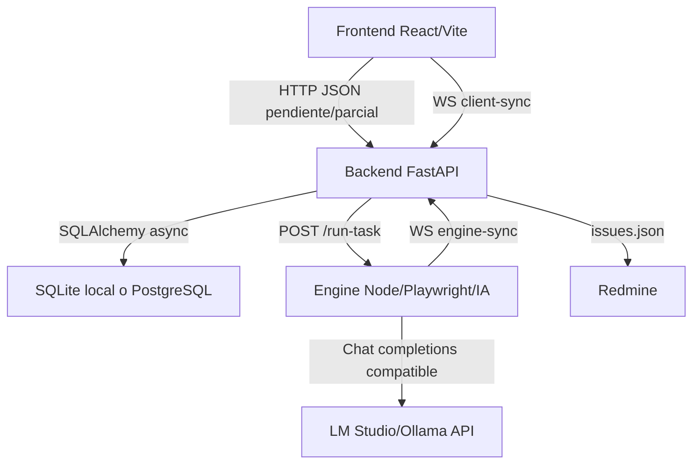

# Architecture - Treseko Platform

Fecha de revision: 2026-06-14.

## Estado

- [x] Arquitectura base documentada.
- [x] Detalle de base de datos movido a `docs/DATABASE.md`.
- [ ] Mantener este documento como resumen arquitectonico y evitar duplicar el modelo completo.

## Referencias

- Modelo de datos detallado: [`DATABASE.md`](DATABASE.md)
- API vigente: [`API_SPEC.md`](API_SPEC.md)
- Estado real: [`STATUS.md`](STATUS.md)
- Configuracion del Motor IA: [`AI_ENGINE_CONFIG.md`](AI_ENGINE_CONFIG.md)

La plataforma esta compuesta por tres capas que todavía estan en proceso de integracion completa.

## Capas

### Frontend

Ubicacion: `frontend/`

Stack:

- React 19.
- Vite 6.
- Bootstrap / React-Bootstrap.
- Lucide React.
- Recharts.

Estado:

- UI avanzada y navegable.
- La mayor parte del estado vive en `frontend/src/App.tsx` como datos mock/locales.
- Integracion real con backend pendiente por módulos.

### Backend

Ubicacion: `backend/`

Stack:

- FastAPI.
- SQLAlchemy async.
- Pydantic v2.
- JWT local con `python-jose`.
- Passlib.
- HTTPX.

Estado:

- API real implementada sin prefijo `/api/v1`.
- Persistencia local recomendada en PostgreSQL: `postgresql+asyncpg://treseko:<DB_PASSWORD>@localhost:5432/treseko_db`.
- SQLite queda solo para lectura puntual de bases legacy con `ALLOW_SQLITE_LEGACY=true`.
- WebSocket relay implementado de forma básica.
- Redmine worker implementado sin deduplicacion real previa.

### Engine

Ubicacion: `engine/`

Stack:

- Node.js.
- Express.
- Socket.io.
- WebSocket `ws`.
- Playwright.
- TypeScript/tsx.

Estado:

- Expone `GET /health`.
- Expone `POST /run-task`.
- En desarrollo local usa `ENGINE_PORT=3010` desde `engine/.env`.
- Recibe configuracion runtime desde backend: LLM, viewport, costos, headless, timeout y workflow activo.
- Tiene CLI con `npm run test -- --help`.
- Se comunica con backend por `BACKEND_WS_URL`.

## Persistencia

Modo local:

- SQLite por default si no hay `DATABASE_URL`.

Modo infraestructura:

- Docker Compose levanta PostgreSQL y Redis.
- Redis esta disponible pero no es dependencia critica documentada del flujo actual.

## Contratos principales

Backend a engine:

- `POST {ENGINE_URL}/run-task`
- Payload con `task`, `url`, `testId`, `suite`, `guidance`, `step_map`, configuracion LLM, viewport y `workflow_definition`.

Engine a backend:

- `WS {BACKEND_WS_URL}/{testId}`
- Eventos actuales: `STREAM_DOM_LOG`, `STEP_RESULT`.

Frontend a backend:

- HTTP API definida en `docs/API_SPEC.md`.
- WebSocket: `/ws/client-sync/{ejecucion_id}`.

## Seguridad

Implementado:

- Login local con JWT.
- Roles `ADMIN` y `TESTER`.
- Algunas rutas protegidas por bearer o rol admin.

Pendiente:

- Proteger de forma consistente todas las rutas sensibles.
- Revisar scopes por organizacion/proyecto.
- No exponer tokens mock en frontend.
- Cambiar `SECRET_KEY` default en entornos reales.

## Módulos de negocio

Implementados o parcialmente implementados:

- Organizaciones.
- Proyectos.
- Componentes.
- Suites jerarquicas.
- Casos versionados.
- Test runs.
- Ejecuciones y snapshots.
- Wiki.
- Entornos/dispositivos/nodos.
- Scheduler basico.
- Redmine.
- Export/import `.QAP`.

Pendientes importantes:

- Retry/historial por caso.
- Deduplicacion real Redmine.
- Integracion frontend/backend.
- Migraciones Alembic.
- Pruebas automatizadas de integracion.

## Roadmap recomendado

2. Decidir versionado API antes de conectar frontend.
3. Conectar frontend por módulos: auth, proyectos, suites, casos.
4. Implementar ejecucion manual persistida con bloqueo secuencial.
5. Cerrar bridge backend-engine con pruebas de WebSocket.
6. Completar Redmine preview + deduplicacion real.
