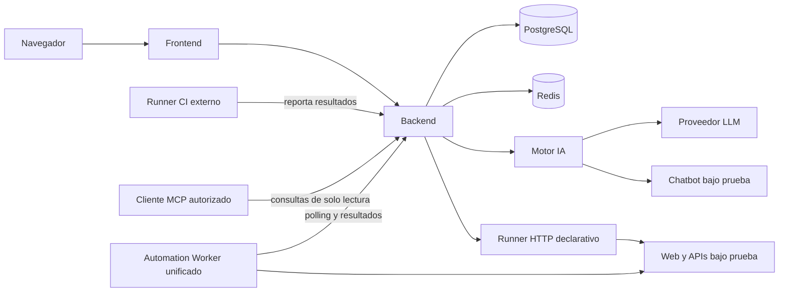

# Arquitectura de Treseko

Guía técnica de Treseko Community 1.0.3 para una instalación self-hosted. La
interfaz no escribe directamente en la base de datos.

## Componentes

```mermaid
flowchart LR
  U[Navegador] --> F[Frontend]
  CI[Runner CI externo] -->|reporta resultados| B
  MCP[Cliente MCP autorizado] -->|consultas de solo lectura| B
  F --> B[Backend]
  B --> P[(PostgreSQL)]
  B --> R[(Redis)]
  B --> E[Motor IA]
  W[Automation Worker unificado] -->|polling y resultados| B
  B --> H[Runner HTTP declarativo]
  E --> L[Proveedor LLM]
  E --> C[Chatbot bajo prueba]
  W --> S[Web y APIs bajo prueba]
  H --> S
```

| Componente | Responsabilidad | Red |
|---|---|---|
| Frontend | Aplicación React y recursos estáticos. | Solo proxy HTTP/HTTPS. |
| Backend | Autenticación, RBAC, reglas, API, snapshots y persistencia. | Servicios autorizados. |
| PostgreSQL | Datos operativos, auditoría y configuración. | Sin puerto público. |
| Redis | Coordinación y colas. | Sin puerto público. |
| Motor IA | Workflows de generación y evaluación. | Privada. |
| Automation Worker | Automatización clásica y API declarativa; toma jobs por polling y devuelve resultados. | Privada; requiere pairing. |
| plugin-runner | Perfil declarado para complementos aislados; no está incluido en este snapshot público. | No operativo desde este paquete. |

El worker usa el profile automation. El profile plugins está declarado en el
Compose, pero este snapshot público no contiene el contexto `plugin-runner`;
no se debe iniciar ni considerar operativo desde este paquete.

## Ejecuciones

formato_prueba y tipo_prueba son independientes:

- CLASICA: pasos, datos y resultado esperado.
- API: contrato treseko.api-test/v1 y aserciones HTTP.
- CONVERSACIONAL: endpoint, turnos, memoria y evaluación.
- PERFORMANCE: formato reservado; no tiene executor de carga documentado.
- tipo_prueba: MANUAL, AUTOMATIZADA o AUTOMATIZADA_AI.

Existe un único Automation Worker. Los jobs API_EXECUTION o framework
treseko-api se enrutan a native-api-runtime.mjs y devuelven
treseko.api-result/v1. La API para resultados externos es otro flujo:
POST /external/executions/report. No hay un segundo worker API.

## Datos y evidencia

Las ejecuciones conservan snapshots de configuración, resultado y evidencia.
Los bugs y reportes elegibles se construyen desde la ejecución persistida.
La política normal redacta secretos, cookies, tokens, variables sensibles y
contenido que supera límites. public_test_data solo permite preservar datos de
prueba marcados explícitamente; nunca datos reales. Snapshots, exports y
enlaces compartidos siguen RBAC.

## Seguridad

- PostgreSQL, Redis, Engine y worker permanecen en red privada. Si se incorpora
  un runner de complementos en una distribución futura, también deberá quedar
  aislado en red privada.
- Inyectá credenciales mediante archivos de secretos, nunca en Git o frontend.
- El backend evalúa capability, nivel y alcance organización/proyecto.
- Respaldá PostgreSQL y adjuntos antes de actualizar.
- El runner no debe recibir socket Docker, mounts host, DB, Redis ni credenciales.

## Continuar

- [Instalación](INSTALLATION.md)
- [Docker](DOCKER_GUIDE.md)
- [Linux](LINUX_SETUP.md)
- [Base de datos](DATABASE.md)
- [Acceso y RBAC](AUTH_RBAC_GUIDE.md)
- [Worker](AUTOMATION_WORKER_V1.md)
- [Portabilidad](CASE_PORTABILITY.md)
