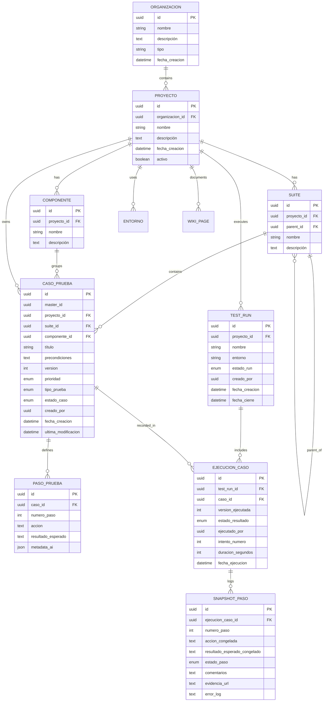

# Database Design - Treseko Platform

Fecha de revision: 2026-06-14.

Este documento define el modelo objetivo para comenzar el desarrollo por módulos evitando refactorizaciones tempranas. La base actual puede correr en SQLite para desarrollo local o PostgreSQL para entorno con Docker.

## Principios de diseno

- El frontend define la experiencia objetivo, pero la base debe registrar todo lo necesario para que las ejecuciones no se pierdan.
- Toda ejecucion debe quedar asociada a proyecto, suite/caso, version del caso, pasos congelados y resultados.
- Los pasos de una ejecucion se guardan como snapshots para que el historial no cambie si el caso se edita luego.
- Redmine se contempla como integracion posterior, no como dependencia inicial del modelo.

## Estados oficiales de ejecucion

Estos estados se usan tanto en `EjecucionCaso.estado_resultado` como en `SnapshotPaso.estado_paso`.

| Estado | Significado | Uso principal |
|---|---|---|
| `SIN_CORRER` | Todavia no fue ejecutado. | Estado inicial de ejecuciones y pasos. |
| `EJECUTANDO_AI` | La ejecucion esta siendo procesada por el engine IA. | Estado temporal mientras corre automatizacion. |
| `PASO` | El paso o caso cumplio el resultado esperado. | Resultado exitoso. En UI puede mostrarse como `OK` o `PASS`. |
| `FALLO` | No se cumplio el resultado esperado y la ejecucion debe considerarse fallida. | Resultado negativo que puede generar analisis o ticket. |
| `BLOQUEADO` | No se pudo ejecutar por impedimento externo o técnico. | Ambientes caidos, datos faltantes, credenciales, dependencias. |


- No equivale a `PASO`.
- No equivale a `FALLO` critico.
- Sirve para registrar una desviacion aceptada temporalmente.
- Debe conservar comentario obligatorio o recomendado para explicar por que se continuo.
- Debe aparecer en métricas separadas para no inflar exitos ni fallos.

## Usuarios, autenticacion y módulos

La tabla `usuarios` es la base inicial de Auth/RBAC.

Campos relevantes:

| Campo | Tipo objetivo | Descripción |
|---|---|---|
| `email` | string ?nico | Identificador principal de login. |
| `hashed_password` | string nullable | Hash de password para usuarios `local`. Puede ser nulo en usuarios `ad`. |
| `nombre_completo` | string nullable | Nombre visible. |
| `rol` | enum | Rol global: `ADMIN`, `QA_LEAD`, `TESTER`, `VIEWER`. |
| `rol_custom_id` | UUID nullable | Rol personalizado opcional creado por administracion. |
| `activo` | boolean | Permite inactivar sin borrar historial. |
| `auth_provider` | string | Proveedor de autenticacion: `local` o `ad`. |
| `módulos` | JSON/lista | Módulos visibles/permitidos para el usuario. |
| `permisos` | JSON/mapa | Permisos por módulo: `read` o `edit`. |

Nota de diseno:

- `módulos` se guarda como JSON para avanzar rapido en SQLite y frontend.
- Si los permisos crecen, conviene normalizar en PostgreSQL a tablas `roles`, `módulos`, `permisos` y `usuario_permisos`.
- Ocultar módulos en frontend no reemplaza permisos backend; las rutas deben validar rol o módulo.

### Roles personalizados

La tabla `roles_personalizados` permite que un `ADMIN` cree roles nuevos desde la aplicación.

Campos principales:

| Campo | Tipo objetivo | Descripción |
|---|---|---|
| `nombre` | string ?nico | Nombre visible del rol. |
| `descripcion` | text nullable | Alcance funcional del rol. |
| `módulos` | JSON/lista | Módulos que heredan los usuarios asignados a ese rol. |
| `permisos` | JSON/mapa | Nivel por módulo: `read` o `edit`. |
| `activo` | boolean | Permite inactivar sin borrar usuarios historicos. |

Los roles base (`ADMIN`, `QA_LEAD`, `TESTER`, `VIEWER`) se mantienen como roles de sistema. Los roles personalizados se apoyan en un rol base técnico y agregan permisos por módulos.

Niveles:

- `read`: lector, puede ver/acceder al módulo.
- `edit`: editor, puede modificar cuando la ruta backend tenga la validación aplicada.

Regla de seguridad: ningún usuario puede inactivar su propia cuenta.

Ver tambien `docs/EXECUTION_STATES.md`.

## ERD objetivo



## Entidades clave

### CasoPrueba

`CasoPrueba` es versionado. Cada cambio importante crea una nueva fila con el mismo `master_id` y `version` incrementada.

Motivo: las ejecuciones historicas deben saber que version exacta se ejecuto.

### PasoPrueba

Define los pasos editables del caso actual.

### TestRun

Agrupa ejecuciones de muchos casos en una corrida: smoke, regresion, release candidate, validación de build, etc.

### EjecucionCaso

Representa el intento de ejecutar un caso dentro de un run. Puede ser manual o automatizado por IA segun el caso/flujo.

### SnapshotPaso

Congela accion y resultado esperado al momento de ejecutar. El resultado real del paso vive aca.

Esto permite:

- Historial confiable.
- Evidencia por paso.
- Reintentos sin perder contexto.
- Analisis posterior aunque el caso original cambie.

### Alcance por build

`BuildCaso` define que casos pertenecen a una build.

- La build es el alcance de ejecucion y reportes.
- Un caso activo puede existir sin estar asignado a una build.
- Solo los casos asignados a la build activa deben aparecer para ejecucion.
- Los reportes de una build deben usar como universo los casos asignados a esa build.
- `DEPRECADO` no es alcance: indica que el caso ya no aplica a nuevas builds, pero conserva historial.

## Pruebas Automatizadas

### Diseño: Biblioteca de funciones + Variables configurables

Para evitar duplicacion de código cuando 100 casos usan la misma funcion (ej: `login()`), se propone:

```
┌─────────────────────────────────────┐
│ Biblioteca de Funciones             │  ← Se define UNA vez
│ - login(usuario, password)          │
│ - logout()                          │
│ - navegar_a_pagina(nombre)          │
└─────────────────────────────────────┘
              ↓ se usa en
┌─────────────────────────────────────┐
│ Scripts de Casos                    │  ← Solo logica especifica
│ - login(USUARIO_TEST, PASS_TEST)    │
│ - buscar_producto("zapatos")        │
│ - assert_resultado_contiene("zap")  │
└─────────────────────────────────────┘

┌─────────────────────────────────────┐
│ Variables de Ejecucion              │  ← Se cambia UNA vez
│ - URL_BASE = "https://app.com"      │
│ - USUARIO_TEST = "test@qa.com"      │
│ Scope: global / proyecto / build    │
└─────────────────────────────────────┘
```

### Nuevas tablas

#### FuncionAutomatizada

Biblioteca de funciones reutilizables versionadas.

| Campo | Tipo | Descripción |
|---|---|---|
| `id` | UUID PK | Identificador ?nico. |
| `master_id` | UUID | Identificador comun para todas las versiones de la funcion. |
| `proyecto_id` | UUID FK | Proyecto al que pertenece. |
| `nombre` | string | Nombre de la funcion: "login", "logout", "buscar_producto". |
| `descripcion` | text | Descripción de que hace la funcion. |
| `codigo` | text | Código Python completo de la funcion. |
| `parametros` | JSON | Lista de parametros: ["usuario", "password"]. |
| `version` | int | Numero de version, incrementa con cada cambio. |
| `creado_por` | UUID | Usuario que creo/versiono la funcion. |
| `fecha_creacion` | datetime | Fecha de creacion de esta version. |

#### VariableEjecucion

Variables configurables con scope (global, proyecto, build).

| Campo | Tipo | Descripción |
|---|---|---|
| `id` | UUID PK | Identificador ?nico. |
| `proyecto_id` | UUID FK | Proyecto al que pertenece. |
| `build_id` | UUID FK nullable | Build especifica. NULL = aplica a todas las builds. |
| `nombre` | string | Nombre de la variable: "URL_BASE", "USUARIO_TEST". |
| `valor` | text | Valor de la variable. |
| `descripcion` | text nullable | Descripción de uso. |
| `scope` | string | "global", "proyecto" o "build". |
| `creado_por` | UUID | Usuario que creo la variable. |
| `fecha_creacion` | datetime | Fecha de creacion. |

#### Extension de CasoPrueba

Agregar campos para scripts automatizados:

| Campo | Tipo | Descripción |
|---|---|---|
| `script_automatizado` | text nullable | Código Python del script (solo logica especifica). |
| `framework` | string nullable | Framework: "playwright" (inicialmente solo este). |

### Prioridad de resolucion de variables

Cuando el script usa `{{URL_BASE}}`, el worker busca en este orden:

1. Variable con `build_id` = build actual (scope "build")
2. Variable con `proyecto_id` = proyecto actual y `build_id` = NULL (scope "proyecto")
3. Variable con `scope` = "global" (proyecto_id = NULL)

Esto permite:
- Definir `URL_BASE` global como "https://app.com"
- Sobreescribir para proyecto "staging" como "https://staging.app.com"
- Sobreescribir para build "v1.1-rc1" como "https://rc1.staging.app.com"

### Flujo de ejecucion automatizada

1. Admin crea funciones comunes en biblioteca (login, logout, navegar).
2. Admin define variables globales o por proyecto/build.
3. Tester escribe script de caso: solo llama funciones + logica especifica.
4. Scheduler o evento de build dispara worker.
5. Worker resuelve variables (prioridad build > proyecto > global).
6. Worker inyecta funciones + variables antes de ejecutar.
7. Worker ejecuta script con Playwright en sandbox.
8. Worker reporta resultados via WebSocket (mismo formato que manual/IA).
9. Resultados persistidos en snapshots.

### Notas técnicas

- Scripts se ejecutan en sandbox (no acceso directo a DB).
- Worker usa cola de tareas para no bloquear.
- Timeout configurable por ejecucion (default 5 minutos).
- Logs de ejecucion persistidos para debugging.
- Evidencia (screenshots) se guarda igual que en manual/IA.

### Herramientas de automatizacion soportadas

| Framework | Lenguaje | Estado | Notas |
|---|---|---|---|
| **Playwright** | Python/JS/TS | **Implementado** | Framework principal. Soporta Chromium, Firefox, WebKit. |
| **Selenium** | Python/Java/JS | Pendiente | Soporte futuro. Amplia compatibilidad con browsers legacy. |
| **Cypress** | JavaScript | Pendiente | Soporte futuro. Enfocado en testing de aplicaciones web modernas. |
| **Puppeteer** | JavaScript | Pendiente | Soporte futuro. Control headless de Chrome/Chromium. |

Nota: La plataforma esta disenada para soportar multiples frameworks. El campo `framework` en `CasoPrueba` y `FuncionAutomatizada` permite especificar cual usar. El worker de ejecucion selecciona el runtime adecuado segun el framework configurado.

## Campos recomendados para evolucion posterior

No son obligatorios para el primer módulo, pero conviene tenerlos presentes:

- `build_id` o `version_build` en `TestRun` o `EjecucionCaso`.
- `datos_prueba` en `CasoPrueba` o `PasoPrueba`.
- `referencia_img_url` en `PasoPrueba`.
- `redmine_issue_id` en `SnapshotPaso` o tabla aparte `DefectoExterno`.
- `origen_ejecucion`: `MANUAL`, `IA`, `MIXTA`.
- `estado_revision`: para aprobacion/revision de resultados dudosos.

## Prioridad de implementacion

1. Organizaciones/proyectos/componentes.
2. Suites y casos versionados.
3. Test runs, ejecuciones y snapshots.
5. Frontend conectado para registrar ejecuciones manuales.
6. Engine IA registrando resultados en snapshots.
7. Redmine como integracion posterior.

## Nota sobre migraciones

El proyecto incluye `alembic` en dependencias, pero las migraciones no estan establecidas como flujo operativo. Antes de avanzar fuerte con datos reales, conviene definir:

- carpeta de migraciones,
- naming convention,
- estrategia SQLite dev vs PostgreSQL,
