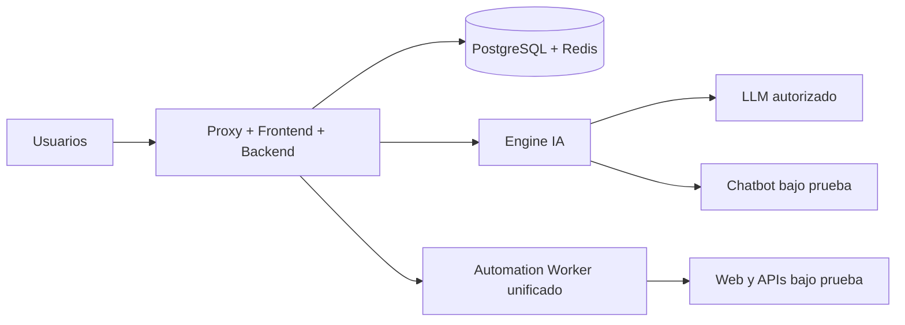

# Despliegue distribuido recomendado

Separá servicios cuando automatización, navegadores o Engine IA compitan con la
interfaz y PostgreSQL. No crea un worker API separado.

Topología recomendada para Treseko Community 1.0.3:

| Nodo | Componentes | Exposición |
|---|---|---|
| A | Proxy, frontend y backend | Solo HTTPS. |
| B | PostgreSQL y Redis | Privada, sin puerto público. |
| C | Engine IA | Privada. |
| D | Uno o más Automation Worker y sus navegadores | Privada; cada uno requiere pairing. |
| L | Proveedor LLM autorizado | Salida controlada según su configuración. |
| P opcional | Perfil de complementos declarado, pero no incluido en este snapshot público | No operativo desde este paquete. |

El worker procesa automatización clásica y API declarativa. Community admite un
solo worker. Agregar workers requiere la capability/entitlement Premium; cada
uno debe vincularse a la organización correcta y tener scope compatible.

## Red

- Usá red privada o VPN.
- Permití solo conexiones necesarias.
- No expongas PostgreSQL, Redis, Engine ni worker. Si una distribución futura
  incorpora el runner de complementos, también deberá permanecer aislado.
- Configurá FRONTEND_PUBLIC_URL con el origen público real.
- Transferí secretos mediante archivos protegidos.

## Pairing

1. Iniciá el worker compatible.
2. Copiá el código de pairing.
3. Aprobalo en Automatización → Workers.
4. Confirmá heartbeat y capacidad.

Si pierde el token persistente, es un nuevo pairing. No reutilices un token
expuesto.

## Evidencia y backups

Respaldá PostgreSQL y adjuntos juntos y probá restauración aislada. En una
instalación pequeña usá un solo host con Compose.
