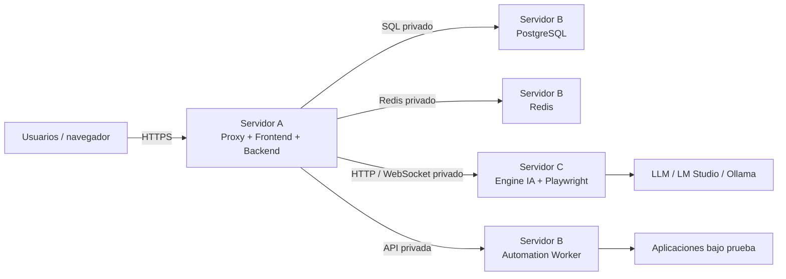

# Despliegue distribuido recomendado

Para instalaciones con mayor carga de automatización, Treseko puede separarse
en servidores independientes. Esto evita que los navegadores, el Engine IA o
los workers compitan con la interfaz y los datos.

## Diagrama de arquitectura

El navegador solo debe acceder al proxy del Servidor A. PostgreSQL, Redis,
Engine y workers deben permanecer en la red privada.

## Responsabilidad de cada servidor

| Servidor | Componentes | Acceso público |
| --- | --- | --- |
| A — aplicación | Proxy, frontend y backend | Solo HTTPS |
| B — datos y jobs | PostgreSQL, Redis y Automation Worker | No |
| C — Engine | Engine IA, Playwright y navegadores | No |
| D — opcional | Workers adicionales | No |

## Recomendaciones básicas

- Usar una red privada o VPN entre los servidores.
- Bloquear desde Internet los puertos de PostgreSQL, Redis y Engine.
- Configurar el backend para usar los nombres privados de los servidores.
- Mantener los secretos fuera del repositorio y del frontend.
- Configurar backups de PostgreSQL y del almacenamiento de evidencias.
- Si aumenta la automatización, agregar workers sin mover la base de datos.

Para una instalación pequeña, todos los servicios pueden ejecutarse en un
único servidor mediante Docker Compose. La separación distribuida es una
opción para crecer sin afectar la disponibilidad de la aplicación.
