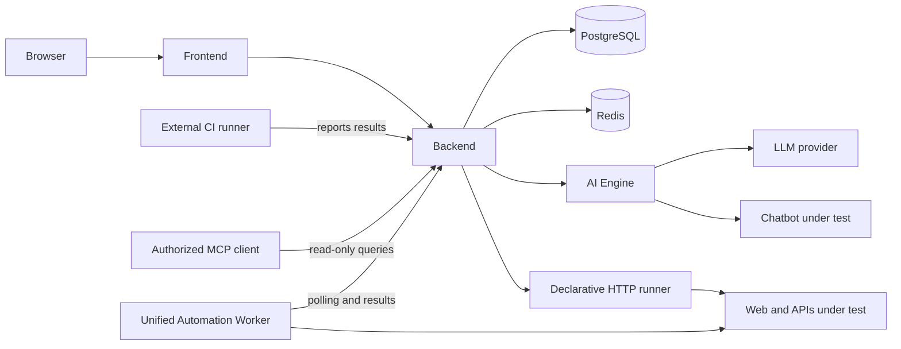

# Treseko architecture

<!-- Language: en -->

Technical guide for a Treseko Community 1.0.3 self-hosted installation. The
interface does not write directly to the database.

## Components

| Component | Responsibility | Network |
|---|---|---|
| Frontend | React application and static resources. | HTTP/HTTPS proxy only. |
| Backend | Authentication, RBAC, rules, API, snapshots and persistence. | Authorized services. |
| PostgreSQL | Operational data, audit and configuration. | No public port. |
| Redis | Coordination and queues. | No public port. |
| AI Engine | Generation and evaluation workflows. | Private. |
| Automation Worker | Classic and declarative API automation; polls for jobs and returns results. | Private; pairing required. |
| plugin-runner | Declared profile for isolated plugins; not included in this public snapshot. | Not operational from this package. |

The worker uses the `automation` profile. The `plugins` profile is declared in
Compose, but this public snapshot does not contain the `plugin-runner` context;
it must not be started or considered operational from this package.

## Executions

`formato_prueba` and `tipo_prueba` are independent:

- `CLASICA`: steps, data and expected result.
- `API`: `treseko.api-test/v1` contract and HTTP assertions.
- `CONVERSACIONAL`: endpoint, turns, memory and evaluation.
- `PERFORMANCE`: reserved format; it has no documented load executor.
- `tipo_prueba`: `MANUAL`, `AUTOMATIZADA` or `AUTOMATIZADA_AI`.

There is one Automation Worker. `API_EXECUTION` or `treseko-api` framework jobs
are routed to `native-api-runtime.mjs` and return `treseko.api-result/v1`. The
external results API is a separate flow: `POST /external/executions/report`.
There is no second API worker.

## Data and evidence

Executions retain configuration snapshots, results and evidence. Eligible bugs
and reports are built from the persisted execution. The normal policy redacts
secrets, cookies, tokens, sensitive variables and content over the limits.
`public_test_data` only allows explicitly marked test data to be preserved; it
never includes real data. Snapshots, exports and shared links follow RBAC.

## Security

- PostgreSQL, Redis, Engine and worker remain on the private network. If a
  plugin runner is included in a future distribution, it must also remain on
  the private network.
- Inject credentials through secret files, never through Git or the frontend.
- The backend evaluates capability, level and organization/project scope.
- Back up PostgreSQL and attachments before updating.
- The runner must not receive the Docker socket, host mounts, DB, Redis or
  credentials.

## Continue

- [Installation](INSTALLATION.md)
- [Docker](DOCKER_GUIDE.md)
- [Linux](LINUX_SETUP.md)
- [Database](DATABASE.md)
- [Access and RBAC](AUTH_RBAC_GUIDE.md)
- [Worker](AUTOMATION_WORKER_V1.md)
- [Portability](CASE_PORTABILITY.md)
