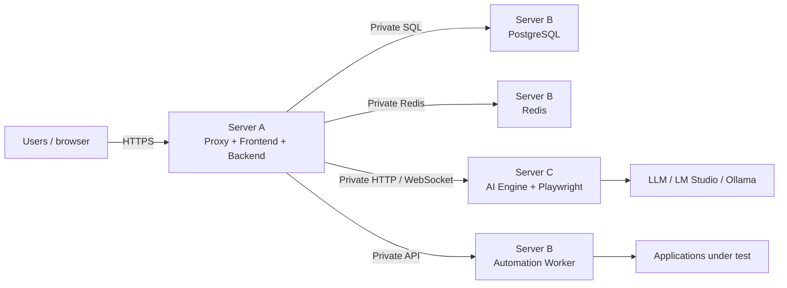

# Recommended distributed deployment

<!-- Language: en -->

For installations with higher automation load, Treseko can be split
into independent servers. This avoids browsers, the AI Engine or
workers competing with the interface and the data.

## Architecture diagram

The browser should only access the Server A proxy. PostgreSQL, Redis,
Engine and workers must remain on the private network.

## Responsibility of each server

| Server | Components | Public access |
| --- | --- | --- |
| A — application | Proxy, frontend and backend | HTTPS only |
| B — data and jobs | PostgreSQL, Redis and Automation Worker | No |
| C — engine | AI Engine, Playwright and browsers | No |
| D — optional | Additional workers | No |

## Basic recommendations

- Use a private network or VPN between servers.
- Block from the Internet the ports of PostgreSQL, Redis and Engine.
- Configure the backend to use the servers' private names.
- Keep secrets out of the repository and out of the frontend.
- Configure backups of PostgreSQL and of the evidence storage.
- If automation grows, add workers without moving the database.

For a small installation, all services can run on a
single server with Docker Compose. The distributed separation is an
option to grow without affecting the availability of the application.