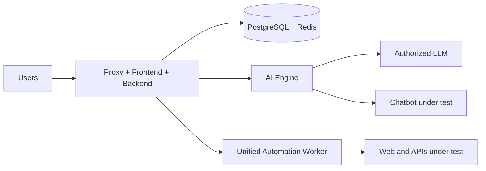

# Recommended distributed deployment

<!-- Language: en -->

Separate services when automation, browsers or the AI Engine compete with the
interface and PostgreSQL. This does not create a separate API worker.

Recommended topology for Treseko Community 1.0.3:

| Node | Components | Exposure |
|---|---|---|
| A | Proxy, frontend and backend | HTTPS only. |
| B | PostgreSQL and Redis | Private, with no public port. |
| C | AI Engine | Private. |
| D | One or more Automation Workers and their browsers | Private; each requires pairing. |
| L | Authorized LLM provider | Controlled outbound access according to its configuration. |
| Optional P | Declared plugin profile, but not included in this public snapshot | Not operational from this package. |

The worker processes classic automation and declarative API automation.
Community supports one worker. Adding workers requires the Premium
capability/entitlement; each one must be paired with the correct organization
and have a compatible scope.

## Network

- Use a private network or VPN.
- Allow only the necessary connections.
- Do not expose PostgreSQL, Redis, Engine or the worker. If a future
  distribution adds the plugin runner, it must also remain isolated.
- Set `FRONTEND_PUBLIC_URL` to the real public origin.
- Transfer secrets through protected files.

## Pairing

1. Start the compatible worker.
2. Copy the pairing code.
3. Approve it in **Automation → Workers**.
4. Confirm the heartbeat and capabilities.

If the persistent token is lost, it is a new pairing. Do not reuse an exposed
token.

## Evidence and backups

Back up PostgreSQL and attachments together and test an isolated restoration.
For a small installation, use a single host with Compose.
